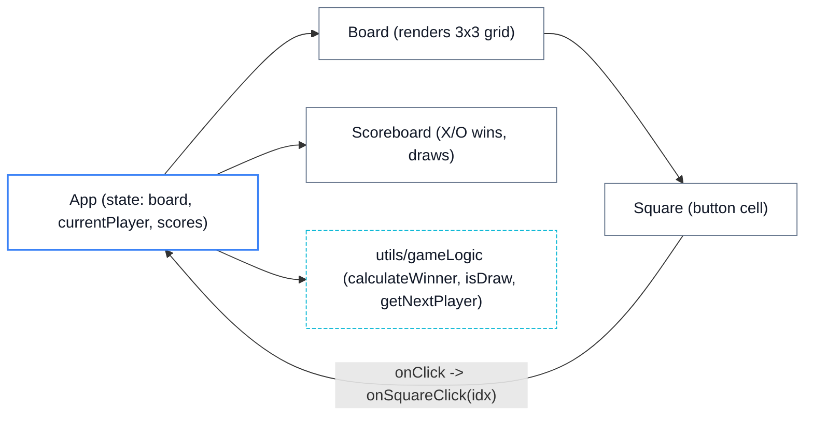
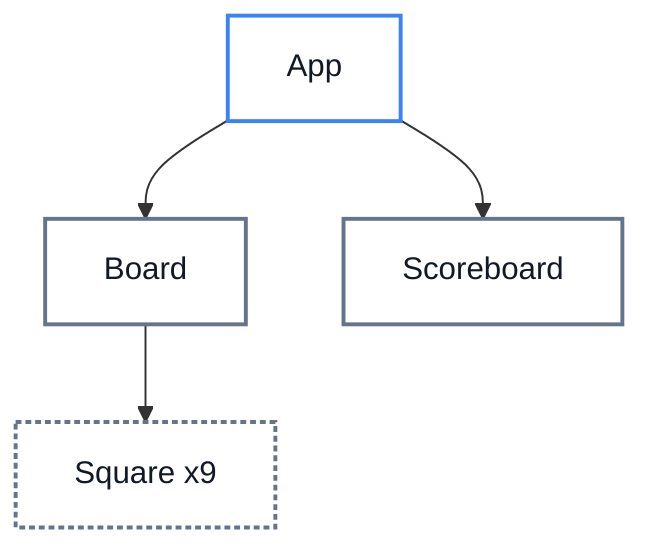
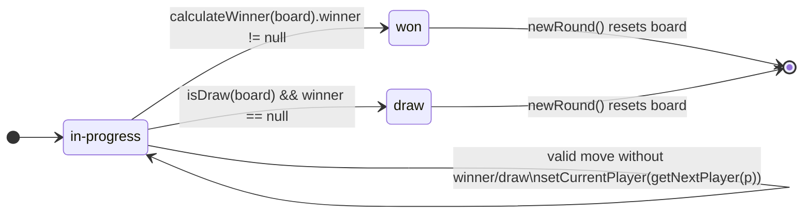
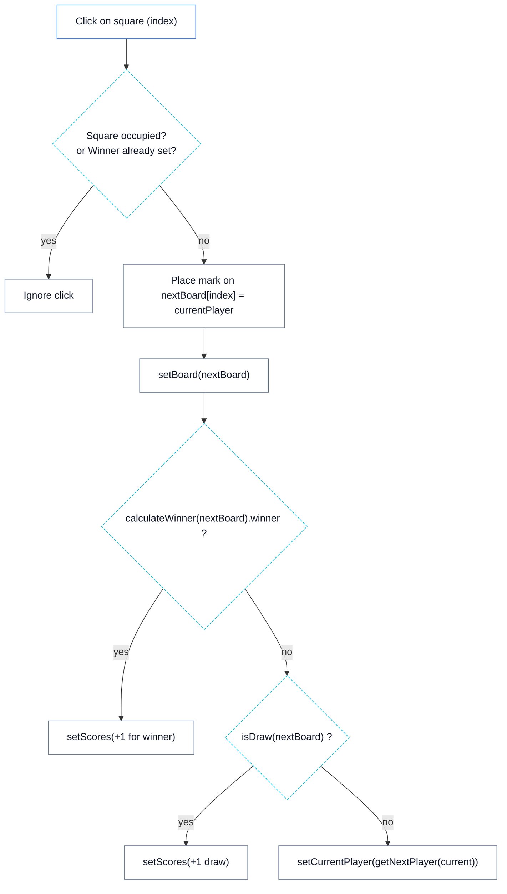
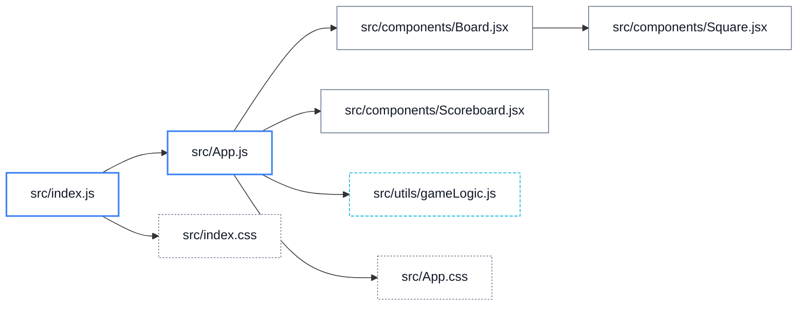

# Tic Tac Toe React App — Architecture and Diagrams

## Overview

This document explains the structure and behavior of the Tic Tac Toe React frontend using concise text and Mermaid diagrams. It covers the high-level architecture, component hierarchy, data flow and state transitions, the move decision flow, and file/module dependencies. The visual language is aligned to the light theme accents defined in the project’s CSS variables:
- primary: #3b82f6
- secondary: #64748b
- success: #06b6d4
- error: #EF4444
- background: #f9fafb
- surface: #ffffff
- text: #111827

## High-Level Architecture

The application is a single-page React app with a small set of functional components and a pure utility module for game rules. App is the stateful container managing the board, the current player, and accumulated scores. Board renders a 3x3 grid of Squares and forwards click events up to App. Scoreboard shows cumulative wins and draws. Game rules are implemented in utils/gameLogic.js as pure functions and used by App to derive outcomes.



## Component Hierarchy

The component tree is shallow and easy to follow: App at the top composes Board and Scoreboard. Board maps nine Square children. Props flow downward; user actions bubble up via callbacks.



### Key Props and Responsibilities

- App
  - State: board: (Array(9).fill(null)), currentPlayer: 'X' | 'O', scores: { xWins, oWins, draws }
  - Derivations: winner, winningLine, draw
  - Handlers: handleSquareClick, newRound, resetAll
- Board
  - Props: board, onSquareClick, winningLine, disabled, currentPlayer
  - Loops over board to render nine Square components
- Square
  - Props: value, index, onClick, isWinning, disabled, currentPlayer
  - Renders a button with classes for X/O and winning highlight
- Scoreboard
  - Props: scores ({ xWins, oWins, draws })
  - Renders badges for totals

## Data Flow and State Transitions

All writeable game state resides in App. Board and Square are controlled components that rely on App state, while user interactions travel upward via callbacks. The following sequence diagram shows a typical move when a user clicks a Square.

```mermaid
sequenceDiagram
  autonumber
  participant U as User
  participant SQ as Square
  participant BD as Board
  participant AP as App
  participant GL as gameLogic.js

  U->>SQ: Click
  SQ->>BD: onClick()
  BD->>AP: onSquareClick(index)
  AP->>AP: Guard: if game over or occupied -> return
  AP->>AP: nextBoard = board.slice(); nextBoard[index] = currentPlayer
  AP->>AP: setBoard(nextBoard)
  AP->>GL: calculateWinner(nextBoard)
  GL-->>AP: { winner, line }
  alt winner found
    AP->>AP: setScores(inc xWins or oWins)
    AP-->>U: Status: "Winner: X|O"
  else no winner
    AP->>GL: isDraw(nextBoard)
    GL-->>AP: true|false
    alt draw
      AP->>AP: setScores(inc draws)
      AP-->>U: Status: "Draw game"
    else not draw
      AP->>GL: getNextPlayer(currentPlayer)
      GL-->>AP: "O" or "X"
      AP->>AP: setCurrentPlayer(next)
      AP-->>U: Status: "Turn: X|O"
    end
  end
```

### State Machine for Round Progress



## Game Logic Decision Flow (Single Move)

The decision logic for a move is pure and deterministic, relying on utils/gameLogic.js. App orchestrates the sequence of checks and updates.



## File/Module Dependency Graph

The project is intentionally small and modular. App is the orchestrator and the only stateful owner. Board, Square, and Scoreboard are presentational with prop-driven behavior. Game rules are pure utilities without React dependencies.



## Notes on Theming and Accessibility

- The color accents in the UI map to CSS variables that align with this document’s color hints in diagrams. For example, primary (#3b82f6) cues current-player and status emphasis, while success (#06b6d4) is used for win highlights.
- Semantic roles and ARIA labels are used to ensure keyboard and screen reader accessibility: Board uses role="grid", Squares use role="gridcell", and live status updates use role="status" with aria-live="polite".
- Buttons support focus-visible outlines using the primary hue for clear focus indication.

## Key Source References

- src/App.js: main state, handlers, rendering of Board and Scoreboard
- src/components/Board.jsx: 3x3 grid, click forwarding, winning line highlighting
- src/components/Square.jsx: accessible grid cell buttons with visual classes
- src/components/Scoreboard.jsx: badge display of cumulative results
- src/utils/gameLogic.js: calculateWinner, isDraw, getNextPlayer
- src/App.css and src/index.css: theme and layout styles
